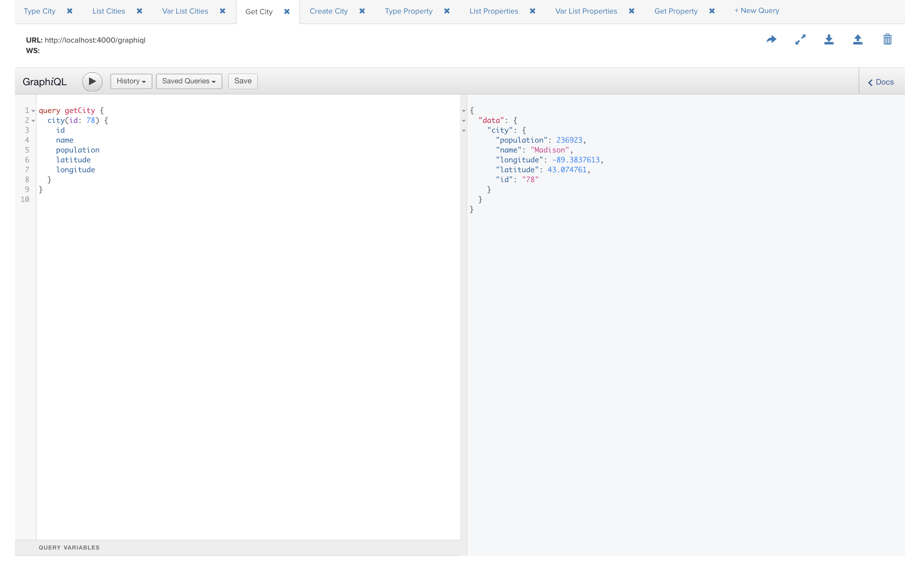
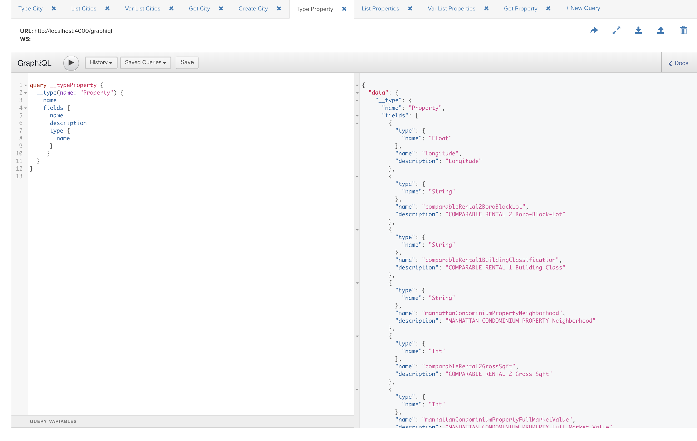

# Cosmo – Exploring ElixirLang's Phoenix / Ecto / Absinthe

This project is using two separate datasets:

* [2014_us_cities.csv](https://github.com/plotly/datasets/blob/master/2014_us_cities.csv)	– (From CSV datasets used in Plotly API examples.)
* [ikqj-pyhc/rows.csv](https://data.cityofnewyork.us/api/views/ikqj-pyhc/rows.csv) – The Department of Finance (DOF) is required by NY State law to value condominiums or cooperatives as if they were residential rental apartment buildings. DOF uses income information from rental properties similar in physical features and location to the condominiums or cooperatives. DOF applies this income data to the condominium or cooperative and determine its value in the same way DOF values rental apartment buildings. Update Schedule: Annually.

These are exposed through a number of different interfaces:

* Web-based CRUD endpoints (REST)
* Web-based query endpoint (querystring)
* GraphQL endpoint

## Query: Type City

## Query: List Cities

## Query: Var List Cities

## Query: Get City

## Mutation: Create City

## Query: Type Property

## Query: List Properties

## Query: Var List Properties

## Query: Get Property

